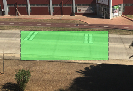

## Resumo

Foram medidas velocidades dos automóveis que circulam na Avenida Almirante Gago Coutinho, que liga Mem-Martins à Portela de Sintra, com recurso a um Raspberry Pi Zero W, uma webcam e um programa Python.
As velocidades obtidas foram tratadas por métodos de análise exploratória de dados com recurso a programação em R.

No estudo realizado verificou-se que a velocidade média dos automóveis difere mediante a direcção em que circulam, sendo de 69 km/h no sentido Mem Martins -> Sintra e 87 km/h no sentido Sintra -> Mem Martins.

Em ambos os casos a velocidade é superior ao máximo permitido por lei em zona urbana - 50km/h. É ainda importante referir que esta zona possui duas escolas nas proximidades e um complexo desportivo, piscinas e ciclovia com elevada afluência de peões.

## Local das medições

As medições foram feitas num pequeno troço da Avenida Almirante Gago Coutinho.   
   

## Hardware e programa carspeed.py

Uma sucinta descrição sobre o hardware utilizado e como instalar o programa `carspeed.py` pode ser encontrada no repositório deste projecto: [VascoRibeiroPereira/carspeed.py](https://github.com/VascoRibeiroPereira/carspeed.py).

O programa utilizado foi adaptado de [gregtinkers/carspeed.py](https://github.com/gregtinkers/carspeed.py), com pequenas alterações no que respeita às distâncias, obtenção de dados em Km/h e inibição da captura de imagens por motivos de eficiência no espaço limitado do hardware utilizado. As direcções foram também adicionadas à tabela de dados obtidos.

## Bibliotecas


As bibliotecas necessárias para análise de dados em R:

```{r, message=FALSE}

library(ggplot2) 
library(dplyr) 
library(lubridate) 
library(googleVis)
library(plotly) 

```

## Importação dos Dados


```{r }

my_wd <- getwd()
filesList <- list.files(paste(my_wd, "/RawData", sep = ""))

setwd(paste(my_wd, "/RawData", sep = ""))

carspeed <- tibble()
for (i in 1:length(filesList)) {
        tmp<- read.csv(filesList[i])   
        
        carspeed <- rbind(tmp, carspeed)
}

```

Os dados de vários ficheiros foram importados e unidos numa única tabela: `carspeed`.   
A tabela `carspeed` tem as seguintes características:   
1. Inicio da obtenção de dados - `r min(levels(carspeed$Date))`   
2. Fim da obtenção de dados - `r max(levels(carspeed$Date))`   
3. Número de observações - `r dim(carspeed)[1]`   
4. Variáveis medidas - `r names(carspeed)`   

## Limpeza dos dados

O conjunto hardware/software utilizados possui algumas limitações no que respeita à detecção de dados, nomeadamente quando há muito trafego nos dois sentidos este pode fazer medições menos correctas. Estes erros traduzem-se em medições com pouco significado (bastante superior a 120 km/h por exemplo), pelo que se excluíram as medições de velocidade superior a 120 km/h e inferiores a 10 km/h.

```{r }

carspeed$Direction <- as.factor(carspeed$Direction)
carspeed_Clean <- filter(carspeed, Speed < 120 & Speed > 10)
carspeed_Clean <- carspeed_Clean[,-2]
carspeed_Clean <- mutate(carspeed_Clean, valid = paste(Date, Time, sep = " "))
carspeed_Clean <- carspeed_Clean[,-c(1,2)]

carspeed_Clean$valid <- parse_date_time(carspeed_Clean$valid, "Ymd HM", tz="Europe/Lisbon")
carspeed_Clean$valid <- round_date(carspeed_Clean$valid, unit = "hour")

## As medições foram sistematizadas apenas a partir de dia 2020-08-03
carspeed_filter <- filter(carspeed_Clean, valid >= as.Date("2020-08-03"))

```

Para a realização da análise de dados estes foram agrupados por data e direcção. Desta forma podemos separar e compreender as diferenças entre as velocidades médias de ambas as direções.

```{r }
groupedData <- carspeed_filter %>% group_by(valid, Direction)
speed_Analysis <- groupedData %>% summarise(meanSpeed = mean(Speed))


speed_Analysis$Direction <- as.integer(speed_Analysis$Direction)

for(i in 1:length(speed_Analysis$Direction)) {
        if (speed_Analysis$Direction[i] == 1) speed_Analysis$Direction[i] <- "Sintra-MemMartins" 
        else speed_Analysis$Direction[i] <- "MemMartins-Sintra"
        }

speed_Analysis$Direction <- as.factor(speed_Analysis$Direction)

Data <- speed_Analysis$valid
Direção <- speed_Analysis$Direction
Velocidade <- speed_Analysis$meanSpeed

df <- tibble(Data, Direção, Velocidade)

```

A tabela `df` obtida após a limpeza dos dados acabou com as dimensões `r dim(df)`, correspondente ao número de observações - velocidade média por hora e por direcção e ao número de colunas (`r names(df)`).   

```{r, echo = FALSE}

knitr::kable(head(df,10))

```

## Análise de dados

A melhor forma de analisar dados é através da sua observação gráfica, assim, utilizou-se uma biblioteca dedicada a este propósito, em que se gerou um gráfico interativo com todos os dados que constam da tabela `df`.

```{r }

gp <- ggplot(data = df, 
       mapping = aes(x = Data, y = Velocidade, color = Direção)) + 
        geom_point(alpha = 1/2)

gg <- ggplotly(gp)

gg

```

A visualização do gráfico torna evidente vários aspectos da circulação automóvel na Avenida Almirante Gago Coutinho, nomeadamente o excesso de velocidade.

Em números absolutos, na tabela antes de agrupar os dados: `carspeed_filter`, temos `r dim(carspeed_filter)[1]` observações, das quais `r sum(carspeed_filter$Speed>50)` são superiores a 50 km/h.   
Isto representa `r round(sum(carspeed_filter$Speed>50)*100/dim(carspeed_filter)[1])`% de condutores em excesso de velocidade a cerca de 40 metros de distância de uma passagem de peões.

**Análise da velocidade em ambas as direções:**

#### Mem Martins - Sintra
```{r, echo=FALSE }

summary(filter(df, Direção == 'MemMartins-Sintra')$Velocidade)

```

#### Sintra - Mem Martins
```{r, echo=FALSE }

summary(filter(df, Direção == 'Sintra-MemMartins')$Velocidade)

```

## Conclusão

A velocidade dos carros que circulam na Avenida Almirante Gago Coutinho é excessiva dadas as características da envolvência: presença de escolas, habitações, peões e locais de desporto e lazer.
Há alguns anos a passadeira foi pintada e evidenciada com refletores coloridos que poderão ter resultado numa descida da velocidade dos automóveis neste local, mas ainda assim são raros os que se mantêm dentro dos limites impostos pela lei.

A presença de lombas poderia ser uma solução para a prevenção de acidentes na área.


